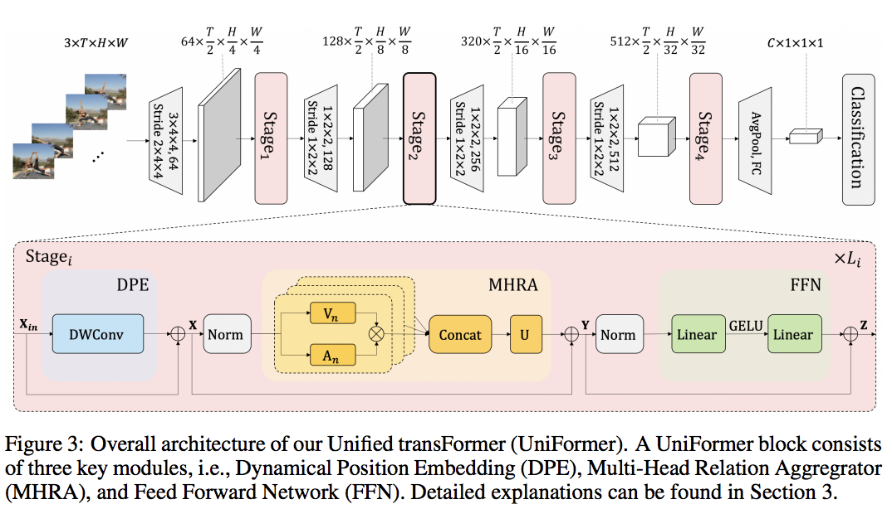

</img>

## Uniformer - Pytorch

Implementation of <a href="https://openreview.net/forum?id=nBU_u6DLvoK">Uniformer</a>, a simple attention and 3d convolutional net that achieved SOTA in a number of video classification tasks

## Install

```bash
$ pip install uniformer-pytorch
```

## Usage

Uniformer-S

```python
import torch
from uniformer_pytorch import Uniformer

model = Uniformer(
    num_classes = 1000,                 # number of output classes
    dims = (64, 128, 256, 512),         # feature dimensions per stage (4 stages)
    depths = (3, 4, 8, 3),              # depth at each stage
    mhsa_types = ('l', 'l', 'g', 'g')   # aggregation type at each stage, 'l' stands for local, 'g' stands for global
)

video = torch.randn(1, 3, 8, 224, 224)  # (batch, channels, time, height, width)

logits = model(video) # (1, 1000)
```

Uniformer-B

```python
import torch
from uniformer_pytorch import Uniformer

model = Uniformer(
    num_classes = 1000
    depths = (5, 8, 20, 7)
)
```

## Citations

```bibtex
@inproceedings{anonymous2022uniformer,
    title   = {UniFormer: Unified Transformer for Efficient Spatial-Temporal Representation Learning},
    author  = {Anonymous},
    booktitle = {Submitted to The Tenth International Conference on Learning Representations },
    year    = {2022},
    url     = {https://openreview.net/forum?id=nBU_u6DLvoK},
    note    = {under review}
}
```
